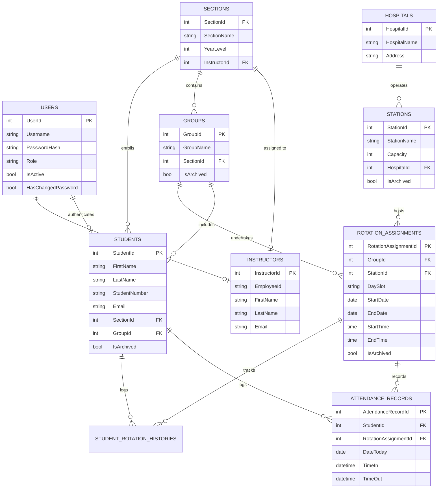

<div align="center">

# 🩺 NurseSync (SNRMS)
### **Student Nurse Rotation Management System**

*A modern, high-performance desktop platform for nursing colleges to coordinate clinical duty rotations, hospital allocations, group scheduling, and digital attendance tracking.*

[](https://dotnet.microsoft.com/)
[](https://learn.microsoft.com/en-us/windows/apps/windows-app-sdk/)
[](https://learn.microsoft.com/en-us/windows/apps/winui/winui3/)
[](https://learn.microsoft.com/en-us/ef/core/)
[](https://www.mysql.com/)
[](LICENSE)

---

</div>

## 📖 Overview

**NurseSync (Student Nurse Rotation Management System - SNRMS)** is an enterprise-grade Windows desktop application built with **.NET 10**, **WinUI 3**, and **Entity Framework Core 9**. Designed specifically for nursing academic institutions and healthcare programs, NurseSync streamlines the complex logistics of scheduling and managing clinical duty rotations across affiliated hospitals and clinical stations.

Nursing programs routinely struggle with manual paper schedules, Excel conflicts, station overcrowding, and untracked student absences during hospital duties. **NurseSync** solves these challenges with automated station capacity validation, schedule conflict prevention, granular role-based dashboards, and interactive visual analytics.

---

## ✨ Key Features

### 🏛️ 1. Administrator Portal
* **Executive Analytics & Metrics**:
  * Real-time counters: Total Students, Total Instructors, Clinical Groups, Hospitals, Active Rotations, and Unassigned Sections.
  * Interactive data visualizations via **LiveCharts2**:
    * Student distribution across sections.
    * Station capacity utilization across hospitals.
    * Rotation breakdown by clinical day slot (**Mon–Tue**, **Wed–Thu**, **Fri–Sat**).
    * Hospital-by-hospital duty assignment breakdowns.
    * Section-level & group attendance performance rates.
* **Academic Section Management**:
  * Organize cohorts by Year Level (**BSN Level 1 through Level 4**).
  * Assign and reassign clinical instructors to academic sections.
* **Hospital & Clinical Station Management**:
  * Maintain affiliated partner hospital directories (names, addresses, branch details).
  * Configure specific hospital stations/wards (e.g., *Emergency Room*, *Pediatrics*, *ICU*, *OB Ward*, *Surgical Unit*) with hard student capacity limits.
  * **Excel Bulk Import**: Quickly import partner hospitals and facilities from standard `.xlsx` spreadsheets via ClosedXML.
* **Faculty & Instructor Management**:
  * Register instructors with Employee IDs, full names, and institutional emails.
  * Active/Inactive account state management with safe soft-delete safeguards.
* **Security & Administrative Overrides**:
  * Password change controls with BCrypt cryptographic hashing.
  * Instant password resets for instructors (resets to `user123`) and students (resets to their student number).

---

### 👨‍🏫 2. Clinical Instructor Dashboard
* **Student & Clinical Group Management**:
  * Create, organize, and manage student duty groups (e.g., *Group 1*, *Group 2*).
  * Add students individually or import entire cohorts via Excel spreadsheets.
  * Dynamic student transfers between groups with full historical integrity.
  * Archive or reactivate students with automated user account synchronization.
* **Intelligent Rotation Scheduler**:
  * Create hospital station rotation assignments with automated conflict prevention:
    * **Station Capacity Enforcement**: Prevents assigning more students than the hospital ward can physically accommodate.
    * **Group Conflict Guard**: Guarantees that a student group cannot be double-booked across overlapping times or dates.
  * Flexible time intervals: Start/End dates, day slot configurations, and duty hours (Time In / Time Out).
* **Digital Attendance & Roster System**:
  * Real-time daily attendance monitoring for current clinical duties.
  * Inspect clock-in and clock-out timestamps for all students assigned to a rotation.
  * Filter attendance records by rotation assignment and date.
* **Instructor-level Analytics**:
  * Visual analytics on group attendance percentages and station load.
  * Automated metrics for the instructor's assigned academic section.

---

### 👩‍⚕️ 3. Nursing Student Dashboard
* **My Active Rotation**:
  * Clean, prominent clinical duty card showing:
    * Current Hospital & Station / Ward name.
    * Assigned Day Slot (e.g., Mon–Tue).
    * Scheduled shift hours (e.g., 07:00 AM – 03:00 PM).
    * Rotation active date window.
* **One-Click Attendance (Time-In / Time-Out)**:
  * Fast clock-in with server timestamp verification.
  * Clock-out capability when shift ends with duplicate prevention.
* **Next Rotation Preview**:
  * Advance visibility into upcoming hospital placements and clinical stations.
* **Clinical Schedule & History**:
  * Full chronological schedule of upcoming duties for the term.
  * Historical log of completed clinical rotations and past attendance logs.
* **Profile & Section Badges**:
  * Display of Student Number, Section, Group, and BSN Year Level.

---

## 🏗️ Architecture & Technology Stack

NurseSync is architected using **Clean Architecture** principles and the **Model-View-ViewModel (MVVM)** pattern, ensuring separation of concerns, testability, and maintainability.

```
┌─────────────────────────────────────────────────────────┐
│                      Presentation                       │
│      WinUI 3 (Windows App SDK) + LiveCharts2 + Skia     │
│                 SNRMS (Desktop Client)                  │
└────────────────────────────┬────────────────────────────┘
                             │ Uses
┌────────────────────────────▼────────────────────────────┐
│                    Application & Core                   │
│         Services, Domain Models, Business Rules         │
│                       SNRMS.Core                        │
└────────────────────────────┬────────────────────────────┘
                             │ Uses
┌────────────────────────────▼────────────────────────────┐
│                   Data Persistence                      │
│     Entity Framework Core 9 (Pomelo MySQL Provider)     │
│               MySQL / MariaDB Database                  │
└─────────────────────────────────────────────────────────┘
```

### Tech Stack Details

| Component | Technology | Version | Purpose |
| :--- | :--- | :--- | :--- |
| **Framework** | .NET | `net10.0` | High-performance modern runtime |
| **UI Framework** | Windows App SDK / WinUI 3 | `1.8+` | Windows 11 Fluent Design & Mica backdrops |
| **MVVM Toolkit** | CommunityToolkit.Mvvm | `8.4.2` | Observable properties, RelayCommands, messaging |
| **ORM** | Entity Framework Core | `9.0.0` | Code-First migrations and relational data access |
| **Database Driver** | Pomelo.EntityFrameworkCore.MySql | `9.0.0` | High-speed MySQL / MariaDB connector |
| **Data Visualizations** | LiveChartsCore.SkiaSharpView.WinUI | `2.0.1` | Hardware-accelerated charts and dashboards |
| **Excel Processing** | ClosedXML | `0.105.0` | Bulk import & export of student/hospital spreadsheets |
| **Cryptography** | BCrypt.Net-Next | `4.1.0` | Secure salted password hashing |

---

## 🗄️ Database Entity Relationship (ERD)



---

## 📁 Repository Structure

```
SNRMS/
├── .github/                       # GitHub workflow actions and templates
├── SNRMS/                         # WinUI 3 Desktop Client Application
│   ├── Assets/                    # Images, icons, and visual branding assets
│   ├── Helpers/                   # XAML Converters (Boolean, Visibility, Time)
│   ├── Properties/                # Publish profiles (win-x64, win-arm64, win-x86)
│   ├── View/                      # Fluent Design XAML pages
│   │   ├── AdminPanelPage.xaml    # Admin dashboard & management interfaces
│   │   ├── InstructorDashboardPage.xaml # Instructor portal & scheduling
│   │   ├── LoginPage.xaml         # Secure authentication page
│   │   └── StudentDashboardPage.xaml # Student rotation & attendance views
│   ├── ViewModels/                # MVVM ViewModels with data bindings
│   │   ├── AdminPanelViewModel.cs
│   │   ├── InstructorDashboardViewModel.cs
│   │   ├── LoginViewModel.cs
│   │   └── StudentDashboardViewModel.cs
│   ├── appsettings.json           # Application configurations and DB connection
│   ├── App.xaml                   # App entry point, DB initialization & Mica setup
│   └── SNRMS.csproj               # WinUI 3 project configuration
├── SNRMS.Core/                    # Business Domain & Data Access Library
│   ├── Data/                      # AppDbContext and EF Core factory
│   ├── Migrations/                # EF Core database migrations
│   ├── Models/                    # Relational domain entity classes
│   ├── Services/                  # Business logic (Auth, Attendance, Rotation, etc.)
│   └── SNRMS.Core.csproj          # .NET 10 Class Library
├── SNRMS.slnx                     # Modern .NET solution file
└── README.md                      # Project documentation
```

---

## 🚀 Getting Started

### Prerequisites

Ensure the following tools and runtimes are installed on your workstation:

1. **Windows 10 version 1809 (Build 17763) or Windows 11**.
2. **Visual Studio 2022 / 2025 (v17.10 or newer)**:
   * Workload: **.NET Desktop Development**.
   * Workload: **Windows application development** (Windows App SDK / WinUI 3).
3. **.NET 10 SDK** (or appropriate multi-targeting runtime).
4. **MySQL Server 8.0+** or **MariaDB 10.5+**.

---

### Installation & Setup

#### 1. Clone the Repository
```bash
git clone https://github.com/lukedongque/SNRMS.git
cd SNRMS
```

#### 2. Configure Database Connection
Open `SNRMS/appsettings.json` and set your MySQL server credentials:
```json
{
  "ConnectionStrings": {
    "DefaultConnection": "Server=localhost;Database=SNRMS;User=root;Password=YOUR_DATABASE_PASSWORD;"
  }
}
```

#### 3. Apply Database Migrations
Run the EF Core migration command using the .NET CLI or the Package Manager Console:
```bash
# Using .NET CLI from project root:
dotnet ef database update --project SNRMS.Core --startup-project SNRMS
```

This will automatically:
* Create the `SNRMS` database schema and all associated tables.
* Seed the initial Administrator account.

#### 4. Build and Run
Open `SNRMS.slnx` in Visual Studio, set `SNRMS` as the Startup Project, choose target architecture `x64`, and press **F5** (or `Ctrl+F5`) to run.

Alternatively, via command line:
```bash
dotnet run --project SNRMS -c Debug -r win-x64
```

---

## 🔑 Default Credentials

Upon running the initial migration, the database seeds default administrative access:

| Role | Username | Password | Notes |
| :--- | :--- | :--- | :--- |
| **Administrator** | `admin` | `admin123` | Master system administrator account |
| **Instructor** | `<EmployeeID>` | `user123` | Default password set upon account creation |
| **Student** | `<StudentNumber>` | `<StudentNumber>` | Default password matches their student ID |

> [!IMPORTANT]
> All users are encouraged to update their temporary credentials via their respective **Settings / Change Password** panels upon initial sign-in.

---

## 📊 Excel File Import Formats

### 1. Hospital Bulk Import Template (`.xlsx`)
Place data starting on Row 2 (Row 1 contains headers):

| Hospital Name (Column A) | Address (Column B) |
| :--- | :--- |
| St. Jude General Hospital | 123 Healthcare Ave, Manila |
| Metropolitan Medical Center | 456 University Belt, Quezon City |

### 2. Student Bulk Import Template (`.xlsx`)
Used by instructors to onboard cohorts to sections:

| First Name (Col A) | Last Name (Col B) | Email (Col C) | Student Number (Col D) |
| :--- | :--- | :--- | :--- |
| Juan | Dela Cruz | juan.delacruz@university.edu | 2023-00101 |
| Maria | Clara | maria.clara@university.edu | 2023-00102 |

---

## 🛡️ Security & Reliability

* **Password Protection**: Passwords are never stored in plaintext. They are hashed using **BCrypt** with automatic salt generation.
* **Capacity & Conflict Constraints**: Rotation bookings are guarded at the service layer to prevent human scheduling mistakes.
* **Soft Deletes**: Student, station, and rotation records utilize `IsArchived` flags, protecting clinical grading and compliance histories from unintended data loss.

---

## 🤝 Contributing

Contributions are welcome! If you have suggestions or improvements:

1. Fork the repository.
2. Create your feature branch (`git checkout -b feature/clinical-evaluation-rubric`).
3. Commit your changes (`git commit -m 'feat: add student clinical evaluation module'`).
4. Push to the branch (`git push origin feature/clinical-evaluation-rubric`).
5. Open a Pull Request.

---

## 📄 License

This project is licensed under the [MIT License](LICENSE) — see the LICENSE file for details.

---

<div align="center">
  <sub>Developed by Luke Dongque &amp; Contributors. Built for Nursing Education Excellence.</sub>
</div>
